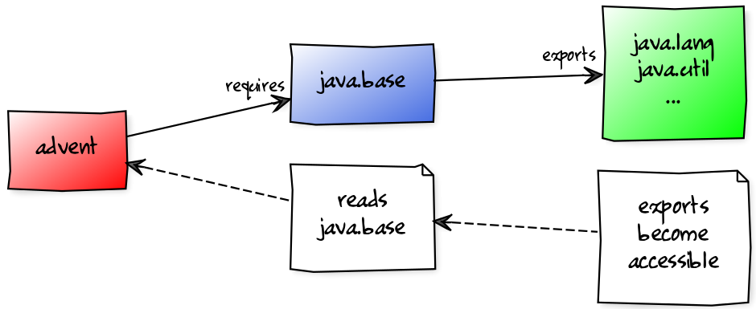
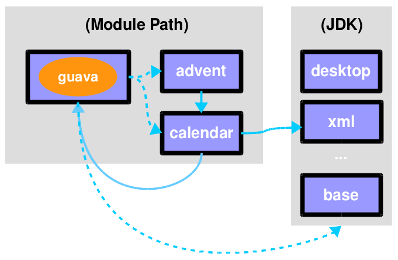

= The Java 9 Module System In Action
:backend: revealjs
:revealjs_center: true
:revealjs_theme: nipa-night
:revealjs_controls: false
:revealjs_history: true
:revealjs_progress: false
:revealjs_parallaxBackgroundImage: images/puzzle-people.jpg
:revealjs_parallaxBackgroundSize: 3246px 1237px
:revealjs_transition: slide
:revealjs_backgroundTransition: fade

++++

++++

++++

	

		
		

			
Nicolai Parlog

			
<a href="http://codefx.org">codefx.org</a>
				/ <a href="https://twitter.com/nipafx" title="Nicolai on Twitter">@nipafx</a>

		

	

	

		
		

			
<a href="https://www.meetup.com/javaBin-Trondheim/">javaBin</a>

			
<a href="https://twitter.com/javabin" title="javaBin on Twitter">@javabin</a>

		

	

++++

++++
<link rel="stylesheet" href="highlight.js/9.2.0.monokai-sublime.css">

++++

// Just adding a footer does not work because reveal.js puts it into the slides
// and we couldn't get it out via CSS. So we move it via JavaScript.
++++
<footer>
	

		
		

			Nicolai Parlog
			/ <a href="http://codefx.org">codefx.org</a>
			/ <a href="https://twitter.com/nipafx" title="Nicolai on Twitter">@nipafx</a>
		

	

	

		
		

			<a href="https://www.meetup.com/javaBin-Trondheim/">javaBin Trondheim</a> /
				<a href="https://twitter.com/javabin" title="javaBin on Twitter">@javabin</a>
		

	

</footer>

++++

// ################################### //
// I M P E D E N C E   M I S M A T C H //
// ################################### //

== Impedance Mismatch

++++
<h3>Where the JVM disagrees with us</h3>
++++

[data-background="images/binary-code.jpg"]
=== How do you think about Software?

++++
<h3>What is it made of?</h3>
++++

[NOTE.speaker]
--
* "think about your favorite project"
* "or about one you're being paid for"
--

[data-background="images/graph.png"]
=== How I think about Software

* interacting parts
* parts have
** names
** dependencies
** capabilities
* creates a graph

[NOTE.speaker]
--
* helps tools and devs to
** dissect
** analyze
** reason about
** work with
* Maven, jdeps
--

[data-background="images/ball-of-mud-2.jpg"]
[data-transition="slide-in none-out"]
=== How the JVM thinks about it

* parts are packaged as JARs
* to the JVM JARs
** have no names
** dependencies are unexpressed
** have no coherent surface
* JVM rolls them into one big ball of mud

[NOTE.speaker]
--
* graph is gone
* "modularity erasure"
--

[data-background="images/ball-of-mud-2.jpg"]
[data-state="empty"]
=== !

[data-background="images/jar-hell.jpg"]
=== Consequences

* http://blog.codefx.org/java/jar-hell/[JAR hell]
** unexpressed, transitive dependencies
** shadowing, version conflicts
** complex class loading
* slow
* unsecure
* maintenance nightmare

// ########################### //
// P R O J E C T   J I G S A W //
// ########################### //

== Project Jigsaw

++++
<h3>Teaching the JVM about that graph</h3>
++++

[NOTE.speaker]
--
* modularity is the keyword
--

=== Quick History

2005:: first discussions about modularity in JDK
2008:: Project Jigsaw is created
2011-2014:: exploratory phase;
ends with https://www.jcp.org/en/jsr/detail?id=376[JSR 376]
2015:: prototype is released
2017:: Java 9 gets released with Jigsaw

[NOTE.speaker]
--
* 2006: Java 6
* 2008:
** to create a simple module system
** just for the JDK
** for Java 7
** "in the next year or so" (http://mreinhold.org/blog/jigsaw[Reinhold])
* 2010: Oracle aquires Sun, Jigsaw is halted
* 2011: Jigsaw gets fully staffed
* 2011: Java 7
* 2014: Java 8
* JSR 376: Java Platform Module System
--

[data-background="images/flag-amsterdam.jpg"]
=== Disclaimer / Call to arms

* this is based on early access builds
* some things can still change
* *time for community feedback +
is running out*

=== Goals

* *Reliable Configuration*
* *Strong Encapsulation*
* Scalable Systems (esp. the JDK)
* Security, Performance, Maintainability

+++<h3>Non-Goals</h3>+++

* Multiple Versions
* Version Selection

[data-background="images/puzzle-cubed.jpg"]
=== Means

Introducing modules, which

* have a name
* express dependencies
* encapsulate internals

Everything else follows from here!

=== Concepts & Features

++++
<ul>
	<li>
Modules, Readability, Accessibility
</li>
	<li class="fragment dim" data-fragment-index="1">
Implied Readability, Qualified Exports
</li>
	<li>
Modular JARs, Module Path, Module Graph
</li>
	<li class="fragment dim" data-fragment-index="1">
Services
</li>
	<li>
Unnamed Modules, Automatic Modules
</li>
	<li class="fragment dim" data-fragment-index="1">
Reflection, Layers
</li>
	<li class="fragment dim" data-fragment-index="1">
Run-time Images
</li>
</ul>
++++

// ################### //
// J M S   B A S I C S //
// ################### //

== Java Module System Basics

++++
<h3>Getting started...</h3>
++++

[data-background="images/puzzle-piece-green.jpg"]
=== Modules

++++
<h3>Pieces of a puzzle</h3>
++++

These are the nodes in our graph.

=== Definition

Modules

* have a unique name
* express their dependencies
* export specific packages +
(and hide the rest)

[NOTE.speaker]
--
* inverse URL naming schema for modules
--

=== Implementation

* Modules are JARs with a `module-info.class` +
(aka *Modular JAR*)
* gets generated from `module-info.java`:
+
[source,java]
----
module $module_name {
	requires $other_module;
	exports $api_package;
}
----
* this is called a *Module Declaration* or a +
*Module Descriptor*

[data-background="images/puzzle-pieces-put-together.jpg"]
=== Readability

++++
<h3>Putting the pieces together</h3>
++++

Readability brings edges into our graph.

It is the basis for *Reliable Configuration*.

=== Definition

For two modules `A` and `B` with +
[source,java]
----
module A {
	requires B;
}
----
we say

* `A` requires `B`
* `A` depends on `B`
* `A` reads `B`
* `B` is readable by `A`

[NOTE.speaker]
--
* Implied Readability also leads to "A reads B"
* the first two are always true
* the last two materialize at run time
--

=== Reliable Configuration

Java will only compile/launch when

* every dependency is fulfilled
* there are no cycles
* there is no ambiguity

[NOTE.speaker]
--
* multiple modules with the same name
* split packages
--

[data-background="images/iceberg.jpg"]
=== Accessibility

++++
<h3>Hiding internals</h3>
++++

Accessibility governs which types a module can see.

It builds on top of Readability.

It is the basis for *Strong Encapsulation*.

=== Definition

A type in one module is only accessible +
by code in another module if

* the type is public
* the package is exported
* the second module reads the first

=== Strong Encapsulation

* `public` is no longer public
* even reflection http://mail.openjdk.java.net/pipermail/jpms-spec-observers/2015-September/000122.html[doesn't work]
* command line provides escape hatches

=== Consequences

* great boost for maintainability
* also the major reason for community unrest
* critical APIs might survive until Java 10 +
(e.g. `sun.misc.Unsafe` -- see http://openjdk.java.net/jeps/260[JEP 260])
* life might get tougher for reflection-based +
libraries and frameworks

[data-background="images/advent-calendar.jpg"]
=== Jigsaw Advent Calendar

++++
<h3>A simple example</h3>
++++

Find it https://github.com/CodeFX-org/demo-jigsaw-advent-calendar[on GitHub]!

=== Structure

// http://yuml.me/edit/64cd5858
image::images/advent-calendar-structure.png[style="diagram"]

=== Code

[source,java]
----
public static void main(String[] args) {
	List<SurpriseF_> fac = asList(
		new ChocolateF_(), new QuoteF_());
	Calendar cal = Calendar.create(fac);
	println(cal.asText());
}
----

// see above
image::images/advent-calendar-structure.png[_,75%,style="diagram"]

////
=== Command Line

[source,bash]
----
# compile
javac -d classes/advent ${*.java}
# package
jar -cfm jars/advent.jar ${*.class, *.mf}
# run
java -jar jars/advent.jar
----

[NOTE.speaker]
--
* explain manifest
* add dependencies to the class path
* works on JDK 9 as is
--
////

=== No Module

* modularization is not required
* JARs continue to work as today!

(Unless you do forbidden things, more on that link:#/_compatibility[later].)

* we can just put the application +
on the class path as before

++++

(Boring...)

++++

=== A single module

++++
<h3>Modularization</h3>
++++

// http://yuml.me/edit/4b1f89ab

[source,java]
----
module advent {
	// java.base is implicitly required
	// requires no other modules
	// exports no API
}
----

++++

(Still Boring...)

++++

[NOTE.speaker]
--
* talk about `java.base`
* this is a simple module graph
--

=== A single module

++++
<h3>Readability & Accessibility</h3>
++++

// http://yuml.me/edit/3144f0af

////
=== A single module

++++
<h3>Command Line</h3>
++++

[source,bash]
----
# compile with module-info.java:
javac -d classes/advent ${*.java}
# package with module-info.class
#	and specify main class:
jar -c --file=mods/advent.jar
	--main-class=advent.Main
	${*.class}
# run by specifying a module path
#	and a module to run (by name):
java -p mods -m advent
----

[NOTE.speaker]
--
* explain module path
--
////

=== Multiple Modules

// image #1: taken from "Structure"
// iamge #2: http://yuml.me/edit/a61aa29b
++++

	

		
	

	

		
	

++++

[NOTE.speaker]
--
* this is another module graph
--

=== Multiple Modules

// taken from previous slide
image::images/advent-calendar-module-multi.png[style="diagram"]

// The outer div's height must be specified explicitly so that vertical space is reserved
// for the non-displayed fragments.
++++

<pre class="highlight"><code class="java language-java hljs">module surprise {
	// requires no other modules
	exports org.codefx.advent.surprise;
}</code></pre>

<pre class="highlight"><code class="java language-java hljs">module calendar {
	requires surprise;
	exports org.codefx.advent.calendar;
}</code></pre>

<pre class="highlight"><code class="java language-java hljs">module factories {
	requires surprise;
	exports org.codefx.advent.factories;
}</code></pre>

<pre class="highlight"><code class="java language-java hljs">module advent {
	requires calendar;
	requires factories;
	requires surprise;
}</code></pre>

++++

=== Multiple Modules

++++
<h3>Compilation, Packaging, Execution</h3>
++++

[source,bash]
----
# First compile/package the other modules
#   ('surprise', 'calendar', 'factories')
#   into folder 'mods'.
# Compile/package 'advent':
javac -p mods -d classes/advent ${*.java}
jar -c --file=mods/advent.jar
	--main-class=org.codefx.advent.Main
	${*.class}
# Launch the application:
java -p mods -m advent
----

// ################# //
// M I G R A T I O N //
// ################# //

== Migration

++++
<h3>Moving Into Module Land</h3>
++++

[data-background="images/keep-out.jpg"]
=== Why Is It Even An Option?

* most module systems are "in or out", +
* but modularized JDK and legacy JARs +
have to cooperate!
* so migration has to be possible

=== Enablers

Migration is enabled by two features:

* Unnamed Module(s)
* Automatic Modules

And the fact that module and class path coexist:

* modular JARs can be put on either
* "regular" JARs can be put on either

[data-background="images/garbage-only.jpg"]
=== The Unnamed Module

++++
<h3>Why The Class Path "Just Works"</h3>
++++

=== Definition

The *Unnamed Module* +
contains _all_ JARs on the class path +
(including modular JARs).

* has no name (surprise!)
* can read all modules
* exports all packages

[NOTE.speaker]
--
* one unnamed module per class loader
--

=== Example

Put all your JARs on the class path.

=== No Access

* what if your code was modularized? +
and your dependencies were not?
* proper modules can not depend on +
"the chaos on the class path"
* this is not possible:
[source,java]
----
module advent {
	requires unnamed;
}
----

=== No Access

image::images/migration-unnamed-dependency.png[style="diagram"]

[data-background="images/golden-gate.jpg"]
=== Automatic Modules

++++
<h3>From Modules To The Class Path</h3>
++++

=== Definition

An *Automatic Module* +
is created _for each_ "regular" JAR +
on the module path.

* gets a name based on the file name
* can read all modules +
(including the Unnamed Module)
* exports all packages

=== Example

* put `guava-19.0.jar` on the module path
* then this works:
[source,java]
----
module advent {
	requires guava;
}
----

=== Example

[data-background="images/confusion.jpg"]
=== What Goes Where?

[cols="s,d,d", options="header"]
|===
|
|Class Path
|Module Path

|Regular JAR
|Unnamed Module
|Automatic Module

|Modular JAR
|Unnamed Module
|Named Module
|===

=== Migration Strategies

Two strategies emerge:

* bottom-up migration
* top-down migration

=== Bottom-Up Migration

Works best for Projects *without* +
unmodularized dependencies +
(libraries).

* turn project JARs into modules
* they still work on the class path
* clients can move them to the module path +
whenever they want

////
=== Bottom-Up Migration

++++
<h3>Example</h3>
++++

TODO: diagram
////

=== Top-Down Migration

Required for Projects *with* +
unmodularized dependencies +
(applications).

* turn project JARs into modules

=== Top-Down Migration

* modularized dependencies:
** require direct ones
** put all on the module path
* unmodularized dependencies:
** require direct ones with automatic name
** put direct ones on the module path
** put others on the class path

[NOTE.speaker]
--
* only required modules are loaded from the module path
* ~> automatic modules' dependencies would not be loaded
* ~> automatic modules' dependencies go on the class path
--

////
=== Top-Down Migration

++++
<h3>Example</h3>
++++

TODO: diagram
////

=== Top-Down Migration

When dependencies get modularized:

* hopefully the name didn't change
* if they are already on the module path, +
nothing changes
* otherwise move them there
* check their dependencies

// ######################### //
// C O M P A T I B I L I T Y //
// ######################### //

== Compatibility

++++
<h3>What to look out for when running on JDK 9</h3>
++++

[data-background=images/broken-glass.jpg]
=== Break Stuff

Some internal changes can
http://blog.codefx.org/java/dev/how-java-9-and-project-jigsaw-may-break-your-code/[break existing code]!

Just by running on JDK 9 +
(even without modularizing the application).

http://openjdk.java.net/jeps/261[JEP 261] contains a list of risks.

[data-background=images/internals.jpg]
=== Internal APIs

* internal APIs are:
** all in `sun.*`
** most in `com.sun.*` +
(unless marked `@jdk.Exported`)
* most if that will be encapsulated
* critical APIs will survive until Java 10 +
(e.g. `sun.misc.Unsafe` -- see http://openjdk.java.net/jeps/260[JEP 260])
* six deprecated methods adding/removing +
`PropertyChangeListener` got removed +
from `LogManager` and `Pack200`

=== What to look for?

* use https://docs.oracle.com/javase/8/docs/technotes/tools/unix/jdeps.html[`jdeps`] (preferably from JDK 9)
** either manually: +
`jdeps -jdkinternals {*.class/*.jar}`
** or as part of your build (e.g. with https://github.com/CodeFX-org/JDeps-Maven-Plugin[JDeps Mvn])
* look for reflection, especially
** `Class::forName`
** `AccessibleObject::setAccessible`
* recursively check your dependencies!

=== What to do?

. contact library developers
. look for alternatives +
(in the JDK or other libraries)
. consider command line flag `-XaddExports`
. turn to the Jigsaw mailing lists

[data-background=images/cut.jpg]
=== Split Packages

* packages should have a unique origin
* no module must read the same package +
from two modules

The current implementation is even stricter:

* no two modules must contain +
the same package (exported or not)
* split packages on the class path +
will be inaccessible

=== Examples

* some libraries split `java.xml.*`, e.g. http://search.maven.org/#artifactdetails|xml-apis|xml-apis|2.0.2|jar[xml-apis]
* some https://issues.jboss.org/browse/WFLY-6375?_sscc=t[JBoss modules] split, e.g., +
`java.transaction`, `java.xml.ws`
* http://mvnrepository.com/artifact/com.google.code.findbugs/jsr305[jsr305] splits `javax.annotation`

=== What to look for?

* search your code and dependencies +
for `java(x)` packages (`jdeps` can help)
* no tool support (http://mail.openjdk.java.net/pipermail/jigsaw-dev/2015-November/005227.html[yet?])

=== What to do?

. is the split on purpose / necessary?
. find other ways to solve the problem
. upgradeable modules to replace run-time modules
. command line `-Xpatch` to add individual classes

[data-background=images/cells.jpg]
=== Run-Time Images

* new JDK/JRE layout
* internal JARs are gone (e.g. `rt.jar`, `tools.jar`)
* JARs are now JMODs
* application class loader is no `URLClassLoader`
* new URL schema for run-time image content

=== What to look for?

* does the code rummage around +
in the JDK / JRE folder?
* search for casts to `URLClassLoader`
* are URLs to JDK classes / resources handcrafted?

[data-background=images/obsolete.jpg]
=== Obsolete

* Endorsed Standards Override Mechanism
* Extension Mechanism
* Boot Class Path Override

[NOTE.speaker]
--
* ext. mech.: makes custom APIs available to all applications running on the JDK
* first 2 replaced by upgradeable modules.
--

=== But wait, there's more!

* yes, yes, there's more
* you should really check http://openjdk.java.net/jeps/261[JEP 261]
* and http://openjdk.java.net/jeps/223[JEP 223] (new version strings)
** goodbye `1.9.0_31`
** hello `9.1.4`

[data-background=images/sign.jpg]
=== General Advice I

The most relevant for most applications:

* internal APIs
* split packages

[data-background=images/sign.jpg]
=== General Advice II

* get your code in shape +
(and prevent relapses)
* check your dependencies and tools
* if any are suspicious +
(automatically true for IDEs, build tools):
** make sure they're alive
** *get them up to date!*
** or look for alternatives
* get an https://jdk9.java.net/[EA-build] and *try it!*

// ################### //
// Q U E S T I O N S ? //
// ################### //

[data-background="images/question-mark.jpg"]
== About

++++

	

++++

++++
<h3>Find Me</h3>
++++
http://codefx.org[codefx.org] +
https://sitepoint.com/java[sitepoint.com/java] +
https://twitter.com/nipafx[@nipafx] /
https://google.com/+NicolaiParlog[+NicolaiParlog]

++++
<h3>Want More?</h3>
++++
2-day course with 42talents +
Zürich, 20.04. - 21.04.2017 +
~> http://42talents.com/training/2017/04/20/Java-9/[register]

or buy http://blog.codefx.org/java-module-system-in-action/[my book]
~> http://blog.codefx.org/newsletter/[subscribe]

////
++++
<h3>Me</h3>
++++

since 2014: Java developer at http://www.disy.net/en/welcome.html[Disy]

2011-2014: Java developer at http://www.isi.fraunhofer.de/isi-en/index.php[Fraunhofer ISI]

until 2010: CS and Math at http://www.tu-dortmund.de[TU Dortmund]
////

// ####### //
// O S G I //
// ####### //

[data-background="images/bundles.jpg"]
== Jigsaw vs. OSGi

OSGi Bundles:

* are JARs with a descriptor (`MANIFEST.MF`)
* have a name
* import packages or bundles
* define public API by exporting packages

[data-background="images/bundles.jpg"]
=== Jigsaw vs. OSGi

[cols="s,d,d", options="header"]
|===
|
|Jigsaw
|OSGi

|Versioning
|not at all
|packages and modules

|Run-time Behavior
|mostly static
|dynamic

|Services
|declarative via `ServiceLoader`
|declarative or programmatically; +
more flexible

|Class Loaders
|operates below
|one per bundle
|===

////

// ############# //
// H I S T O R Y //
// ############# //

== History ==

=== Distant Past ...

2005/2006:: https://jcp.org/en/jsr/detail?id=277[JSR 277] and https://jcp.org/en/jsr/detail?id=294[JSR 294] start talking about modularizing the JDK
2008::
** JSR 277 is abandoned due to complexity
** JSR 294 becomes the vehicle for the new Project Jigsaw:
+
*** to create a simple module system
*** just for the JDK
*** "in the next year or so" [http://mreinhold.org/blog/jigsaw[Reinhold]]
2010:: Oracle acquires Sun; Jigsaw is halted
2011:: demand for a standard Java module system is reestablished

[NOTE.speaker]
--
* December 2006: Java 6
* July 2011: Java 7
* March 2014: Java 8
--

=== ... Past ...

2011::
** demand for a standard Java module system is reestablished
** requirements are formulated
** Jigsaw is chosen as the vehicle
** gets fully staffed
** enters "exploratory phase"
2012::
** Jigsaw postponed to Java 9
** Compact Profiles fill the gap (http://openjdk.java.net/jeps/161[JEP 161])
** modularization is prepared in Java 8 (http://openjdk.java.net/jeps/162[JEP 162])

[NOTE.speaker]
--
* December 2006: Java 6
* July 2011: Java 7
* March 2014: Java 8
--

=== ... Present ...

2014::
** exploratory phase ends with a plethora of JEPs:
*** http://openjdk.java.net/jeps/200[JEP 200]: define a modular structure for the JDK
*** http://openjdk.java.net/jeps/201[JEP 201]: reorganize source
*** http://openjdk.java.net/jeps/220[JEP 220]: create run-time images for modules
*** http://openjdk.java.net/jeps/260[JEP 260]: encapsulate (most) internal APIs
*** http://openjdk.java.net/jeps/261[JEP 261]: implement module system
** all collected under https://www.jcp.org/en/jsr/detail?id=376[JSR 376: Java Platform Module System]
2015::
JDK-9-with-Jigsaw https://jdk9.java.net/jigsaw/[early access builds] contain all relevant changes to experiment with the module system

=== ... Future

2016::
** *May*: JDK 9: feature complete
** *June*: JSR 376: public review
** *December*: JSR 376: final draft
2017::
** *January*: JDK 9: final release candidate
** *March*:
*** JSR 376: final release
*** JDK 9: general availability

////

// ######### //
// A N N E X //
// ######### //

== Image Credits

=== Introduction

* puzzle-people:
https://www.flickr.com/photos/pagedooley/[Kevin Dooley]
(https://creativecommons.org/licenses/by/2.0/[CC-BY 2.0])
* binary-code:
https://www.flickr.com/photos/132889348@N07/[Christiaan Colen]
(https://creativecommons.org/licenses/by-sa/2.0/[CC-BY-SA 2.0])
* graph:
https://www.flickr.com/photos/chef_ele/[chef_ele]
(https://creativecommons.org/licenses/by/2.0/[CC-BY 2.0])
* ball-of-mud-2:
https://www.flickr.com/photos/elgentscho/[Andi Gentsch]
(https://creativecommons.org/licenses/by-sa/2.0/[CC-BY-SA 2.0])
* jar-hell:
https://wellcomelibrary.org/[Wellcome Library, London]
(https://creativecommons.org/licenses/by/4.0/[CC-BY 4.0])

=== Project Jigsaw

* flag-amsterdam:
https://www.flickr.com/photos/rogersg/[George Rex]
(https://creativecommons.org/licenses/by-sa/2.0/[CC-BY-SA 2.0])
* puzzle-cubed:
https://www.flickr.com/photos/dps/[David Singleton]
(https://creativecommons.org/licenses/by/2.0/[CC-BY 2.0])

=== Java Module System

* puzzle-piece-green: +
http://www.stockmonkeys.com/[StockMonkeys.com]
(https://creativecommons.org/licenses/by/2.0/[CC-BY 2.0])
* puzzle-pieces-put-together: +
http://www.seniorliving.org[Ken Teegardin]
(https://creativecommons.org/licenses/by-sa/2.0/[CC-BY-SA 2.0])
* iceberg: +
https://www.flickr.com/photos/usoceangov/[NOAA's National Ocean Service]
(https://creativecommons.org/licenses/by/2.0/[CC-BY 2.0])
* advent-calendar:
https://www.flickr.com/photos/littlestuffme/[Tina D]
(https://creativecommons.org/licenses/by/2.0/[CC-BY 2.0])
* class and module diagrams: +
http://blog.codefx.org/about-nicolai-parlog/[Nicolai Parlog]
(https://creativecommons.org/licenses/by-nc/4.0/[CC-BY-NC 4.0])

=== Migration

* keep-out:
https://www.flickr.com/photos/smithser/[Brian Smithson]
(https://creativecommons.org/licenses/by/2.0/[CC-BY 2.0])
* garbage-only:
https://www.flickr.com/photos/peterkaminski/[Peter Kaminski]
(https://creativecommons.org/licenses/by/2.0/[CC-BY 2.0])
* golden-gate:
https://www.flickr.com/photos/82955120@N05/[Nicolas Raymond]
(https://creativecommons.org/licenses/by/2.0/[CC-BY 2.0])
* confusion:
https://www.flickr.com/photos/procsilas/[Procsilas Moscas]
(https://creativecommons.org/licenses/by/2.0/[CC-BY 2.0])
* module diagrams: +
http://blog.codefx.org/about-nicolai-parlog/[Nicolai Parlog]
(https://creativecommons.org/licenses/by-nc/4.0/[CC-BY-NC 4.0])

=== Compatibility

* broken-glass: +
https://www.flickr.com/photos/akeg/[Eric Schmuttenmaer]
(https://creativecommons.org/licenses/by-sa/2.0/[CC-BY-SA 2.0])
* internals:
https://www.flickr.com/photos/thedonquixotic/[David French]
(https://creativecommons.org/licenses/by/2.0/[CC-BY 2.0])
* cut:
https://www.flickr.com/photos/span112/[Jinx!]
(https://creativecommons.org/licenses/by-sa/2.0/[CC-BY-SA 2.0])
* cells:
https://www.flickr.com/photos/jonolist/[Jonathan Lin]
(https://creativecommons.org/licenses/by-sa/2.0/[CC-BY-SA 2.0])
* obsolete:
https://www.flickr.com/photos/trevor-king/[Trevor King]
(https://creativecommons.org/licenses/by/2.0/[CC-BY 2.0])
* sign:
https://www.flickr.com/photos/duncharris/[Duncan Harris]
(https://creativecommons.org/licenses/by-sa/2.0/[CC-BY-SA 2.0])

=== Rest

* question-mark:
http://milosevicmilos.com/[Milos Milosevic]
(https://creativecommons.org/licenses/by/2.0/[CC-BY 2.0])
* bundles:
https://www.flickr.com/photos/dmahendra/[Danumurthi Mahendra]
(https://creativecommons.org/licenses/by/2.0/[CC-BY 2.0])
